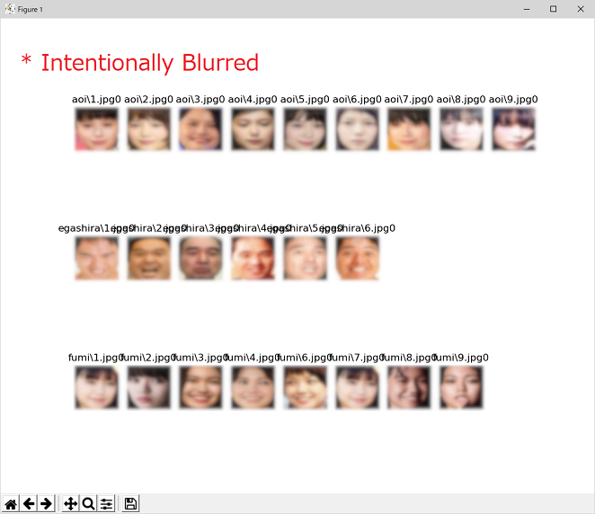
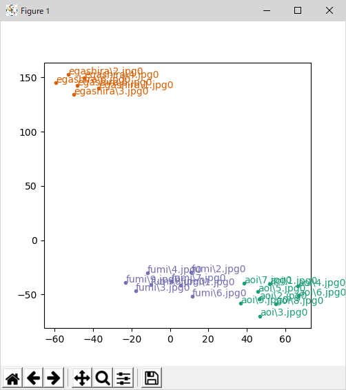

# Visualization of Facial Feature Vectors using T-SNE Algorithm
The OpenVINO(tm) Open Model Zoo (OMZ) provides several facial feature extraction models. Those models take a cropped face image and generates a feature vector which consists of 256 FP32 values. Users can identify similar objects by calculating the norm (or distance) of those feature vectors.  
This is a sample program to demonstrate how to visualize those multi-dimentional vectors on a 2D chart.  
This program uses t-SNE (T-distributed stochastic neighbor embedding) method to reduce the dimention of the vectors from 256 to 2, then plot the vectors on a chart.  
You can understand that the chart shows the good separation of the feature vectors. The same persons faces are plotted close to each other and separated from the other faces.  

OpenVINO(tm) Open Model Zooではいくつかの顔特徴ベクトル抽出モデルを提供しています。これらのモデルは切り抜かれた顔イメージを入力とし、256のFP32数値からなる特徴ベクトルを出力します。ユーザーはこの特徴ベクトル同士の距離を計算することでオブジェクトの同定を行うことが可能です。  
ここではこの多次元特徴ベクトルを2次元の図に表示する方法について説明しています。  
このプログラムではt-SNE (T-distributed stochastic neighbor embedding)法を使用し、特徴ベクトルの次元数を256から2に圧縮し、図に表示しています。  
図を見ると、特徴ベクトルがきれいに分離されていることがわかります。同じ人の顔のベクトルは近くに、そして他の人のベクトルからは離れた位置にプロットされています。

**The faces found in the `./face-db` directory**
  

**Scatter Chart of the face feature vectors obtained by `face-reidentification` model**


## Required DL Models to Run This Demo

The demo expects the following models in the Intermediate Representation (IR) format:

 * For face detection and re-identification 
   * `face-detection-adas-0001`
   * `face-reidentification-retail-0095`


You can download those models from OpenVINO [Open Model Zoo](https://github.com/opencv/open_model_zoo).
In the `models.lst` is the list of appropriate models for this demo that can be obtained via `Model downloader`.
Please see more information about `Model downloader` [here](../../../tools/downloader/README.md).

## How to Run

(Assuming you have successfully installed and setup OpenVINO 2020.2. If you haven't, go to the OpenVINO web page and follow the [*Get Started*](https://software.intel.com/en-us/openvino-toolkit/documentation/get-started) guide to do it.)  

### 1. Install dependencies  
The demo depends on:
- `opencv-python`
- `numpy`
- `scipy`
- `scikit-learn`
- `matplotlib`

To install all the required Python modules you can use:

``` sh
(Linux) pip3 install -r requirements.txt
(Win10) pip install -r requirements.txt
```

### 2. Download DL models from OMZ
Use `Model Downloader` to download the required models.
``` sh
(Linux) python3 $INTEL_OPENVINO_DIR/deployment_tools/tools/model_downloader/downloader.py --list models.lst
(Win10) python "%INTEL_OPENVINO_DIR%\deployment_tools\tools\model_downloader\downloader.py" --list models.lst
```

### 3. Prepare face images
This program will search images (jpg/bmp/png) from `./face-db` directory. You can create the directories under `./face-db` as many as you want. The directory names and the file names are displayed right next to the dot on the chart so that you can identify which data it is.  
This program will detect the faces from the images, crop the found faces and register them to the DB.  

#### Example of `face-db`
```sh
./
+ face-db/
| + person0/
| | + 0.jpg
| | + 1.jpg
| + person1/
| | + 0.jpg
| | + 1.jpg
```

### 4. Run the demo app
This program doesn't take any command line arguments. All file names and paths are hard coded in the source code.
``` sh
(Linux) python3 face-feature-visualization.py
(Win10) python face-feature-visualization.py
```

## Demo Output  
The application displays the face database (found faces), then a chart.

## Tested Environment  
- Windows 10 x64 1909 and Ubuntu 18.04 LTS  
- Intel(r) Distribution of OpenVINO(tm) toolkit 2020.2  
- Python 3.6.5 x64  

## See Also  
* [Using Open Model Zoo demos](../../README.md)  
